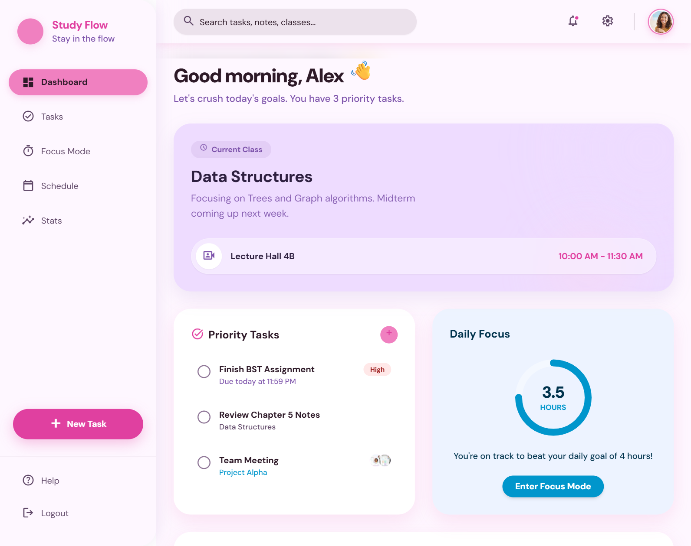
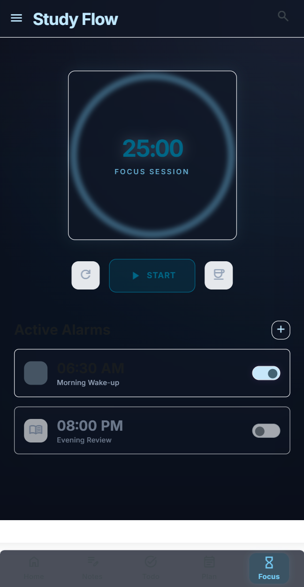
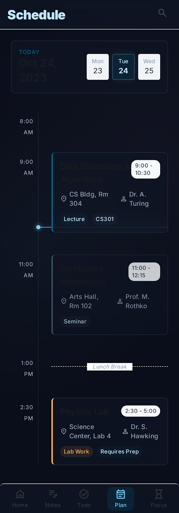
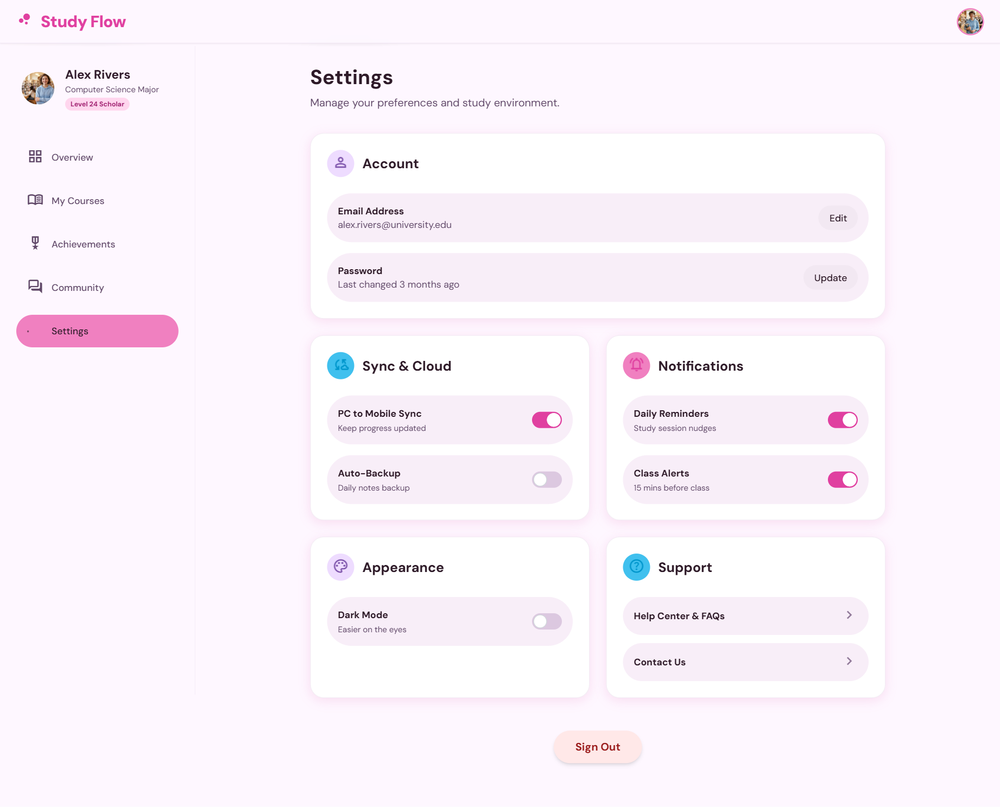
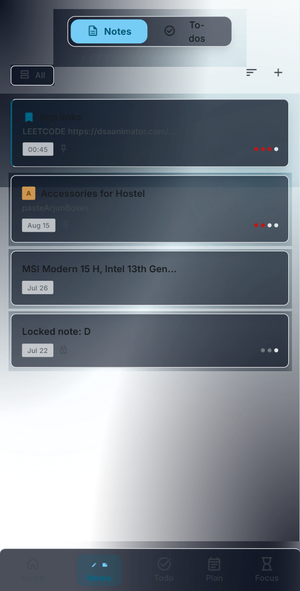

# studyzflow 🎓⚡

**studyzflow** is an intelligent, modern academic productivity suite built with React 19, TypeScript, Tailwind CSS, and Capacitor for Android (Android 14–16 / OriginOS 6) and Web.

---

## 📸 Screenshots Showcase

<p align="center">
  
  
</p>

<p align="center">
  
  
</p>

<p align="center">
  
  
</p>

---

## ✨ Phase 4 Highlights & Key Features

### 1. 🔮 3D Draining Spherical Liquid Glass Timer
- **Realistic Physics & Depletion**: The 3D liquid sphere starts **100% full** and smoothly drains down to **0% (empty)** as the countdown completes.
- **Convex Glass Aesthetics**: Specular highlights, depth rings, rim lighting, glare arcs, and animated rising bubbles.
- **Color Themes**: Electric Indigo, Sunset Orange, Emerald Focus, Rose Bloom, and Cosmic Violet presets.
- **Native Alarms**: Configure daily or single-run study alarms with audio chimes.

### 2. 📊 Academic Command Center (Dashboard)
- **Live Day & Date Display**: Real-time formatted academic calendar pill (`📅 Tuesday, August 25, 2026`).
- **Quick Schedule & Task Overview**: Daily lecture schedule, pending priority tasks, streak count, and daily focus stats.
- **Fast Actions**: Quick modal to add tasks or jump straight into study flow.

### 3. 📝 Tasks & Full-Page Rich Note Editor
- **Date & Time Tracking**: Tasks support due dates with specific due times (e.g. `Aug 25, 2026 at 5:00 PM`).
- **Enlarged Formatting Toolbar**: Comfortable, high-contrast buttons for Bold, Italic, Underline, Headings (H1/H2), Quotes, Code, Alignment, Lists, Tables, and Checklists.
- **Subtasks & Categorization**: Subtasks with progress bars, priority flags (Important / General), and tag filtering.

### 4. 📅 Weekly Interactive Timetable
- Multi-day class schedule with lecture/lab/seminar badges, room numbers, instructors, and custom color accents.

### 5. 🔔 Native Notifications & Permissions
- **OriginOS 6 & Android 16 Support**: Android 13+ runtime notification permissions and Capacitor Local Notifications.
- **Instant Test Alerts**: One-tap "Send Test Alert" button in Settings to verify device sound and banner banners.

### 6. 📱 Android 16 & OriginOS 6 Ready
- **Adaptive Vector Icons**: Clean `ic_launcher_foreground.xml` and `ic_launcher_monochrome.xml` for Material You dynamic theming.
- Edge-to-edge layout, dark theme optimization, and touch-first interactions.

### 7. ☁️ Real-time Cloud Sync & Offline-First
- **Firebase Auth & Firestore**: Multi-device live synchronization between PC and Android.
- **Offline Storage**: Full localStorage fallback with automatic sync replay on reconnection.
- **JSON Backup**: One-click encrypted JSON workspace export and import.

---

## 🛠️ Technology Stack

| Layer | Technologies |
|---|---|
| **Frontend Framework** | React 19, TypeScript, Vite |
| **Styling & Effects** | Tailwind CSS, Custom 3D Glassmorphism CSS |
| **Mobile Runtime** | Capacitor 8 (Android 14, 15, 16 / OriginOS 6) |
| **Cloud Backend** | Firebase Auth (Email/Password), Cloud Firestore |
| **Notifications** | `@capacitor/local-notifications`, Web Notifications API |
| **Icons & Visuals** | Lucide React, Canvas Confetti |

---

## 🚀 Getting Started

### 1. Prerequisites
- **Node.js**: v20 or newer
- **npm**: v10 or newer
- **Android Studio**: Ladybug / Jellyfish with Java 17 (for Android builds)

### 2. Run the Web Application
```bash
# Clone the repository
git clone https://github.com/dineswarakumar062/smart-study-flow-.git
cd smart-study-flow-

# Navigate into app and install dependencies
cd app
npm install

# Start Vite development server
npm run dev
```

### 3. Firebase Configuration
Copy `app/.env.example` to `app/.env` and supply your Firebase project credentials:
```env
VITE_FIREBASE_API_KEY=your_firebase_api_key
VITE_FIREBASE_AUTH_DOMAIN=your-project.firebaseapp.com
VITE_FIREBASE_PROJECT_ID=your-project-id
VITE_FIREBASE_STORAGE_BUCKET=your-project.firebasestorage.app
VITE_FIREBASE_MESSAGING_SENDER_ID=your_sender_id
VITE_FIREBASE_APP_ID=your_app_id
```

Publish Firestore rules from [`firestore.rules`](./firestore.rules) in the Firebase console.

---

## 📱 Building & Installing on Android

```bash
# From the /app directory
npm run build
npx cap sync android
```

1. Open `app/android` in **Android Studio**.
2. Ensure Gradle JDK is configured to **Java 17** (`Settings → Build Tools → Gradle → Gradle JDK`).
3. Connect your Android device with USB debugging enabled.
4. Click **Run** (`Shift + F10`) to build and deploy **studyzflow** directly to your phone.

---

## 📋 Useful Commands

```bash
cd app
npm run dev           # Start Vite hot-reload server
npm run build         # Type-check and build production assets
npx cap sync android  # Sync web build and plugins to Android
```

---

## 📄 License
MIT License. Created for students and lifelong learners.
